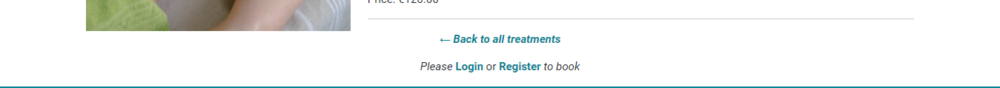
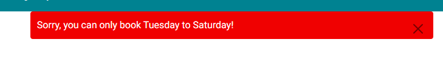

# Serenity Day Spa 
[View my live site here](https://serenity-day-spa-c4459ce39df8.herokuapp.com/)

Serenity Day Spa is a site for a fictional new business based in the South East coastal town of Tramore, Co. Waterford, Ireland. The Spa is centered around offering treatments to customers looking to book a relaxing appointment to escape and unwind. Serenity Day Spa provides users with a treatment menu, account registration, and booking process.
Unregistered users of this site can access all the information they need to know about Serenity Day Spa treatments, and can contact the site owners with any queries they may have via a contact form. Registered account users can book, edit and cancel their appointments via their user account dashboard, and also contact the site admin via the contact form.

## Contents
* [Project Goals](#project-goals)
* [User Stories](#user-stories)
* [Agile Development](#agile-development)
* [UX](#ux)
  * [Strategy](#strategy)
  *	[Scope](#scope)
  * [Structure](#structure)
  * [Skeleton](#skeleton)
    * [Flowchart](#flowchart)
  * [Surface](#surface)
* [Design](#design)
  * [Colour Scheme](#colour-scheme)
  * [Typography](#typography)
  * [Imagery](#imagery)
* [Database ERD](#database-erd)
* [Project Features](#project-features)
  * [Navbar](#navbar)  
  * [Home](#home)
  * [Treatments](#treatments)
  * [Contact](#contact)
  * [Login](#login)
  * [Register](#register)
  * [Book Now](#book-now)
  * [My Account - User](#my-account)
  * [User Feedback](#user-feedback)
  * [Custom Handler Pages](#custom-handler-pages)
  * [Security Features](#security-features)
* [Future Features](#future-features)
* [Technologies Used](#technologies-used)
  * [Languages](#languages)
  * [Frameworks, Libraries, Technologies and Programs used](#frameworks-libraries-technologies-and-programs-used)
* [Testing](#testing)
  * [Manual Testing](#manual-testing)
  * [HTML Validation](#html-validation)
  * [CSS Validation](#css-validation-using-w3c-validation) 
  * [Lighthouse scores using Chrome Dev Tools](#lighthouse-scores-using-chrome-dev-tools)
  * [Pep8 Validation](#pep8-validation)
  * [Bugs](#bugs)
* [Deployment](#deployment)
  * [Deploying to Heroku](#Deploying-to-heroku)
  * [Forking the GitHub Repository](#forking-the-github-repository)
  * [Clone the GitHub Repository](#clone-the-github-repository)
* [Credits](#credits)
  * [Code References](#code-references)
  * [Content and Media References](#content-and-media-references)
* [Acknowledgements](#acknowledgements)  
         
 
___

### Project Goals

The goal of this project is to create a tranquil and inviting online platform for users where they can easily access information about Serenity Day Spa’s range of relaxation treatments, and encourage visitors to register an account to book appointments.

___

### User Stories

**As a site user:**
* I can view a list of treatments so that I can select which one I want to view. - MUST HAVE
* I can click on a treatment so that I can read the full description - MUST HAVE
* I can register an account so that I can book an appointment - MUST HAVE
* I can fill out a contact form so that I can contact the business with any queries I may have - MUST HAVE

**As a registered user:**
* I can create, view, update, delete bookings so that I can manage my appointments - MUST HAVE
* I can fill out a contact form so that I can contact the business with any queries I may have - MUST HAVE
* I can leave a review so that I can give my feedback to the business and other site users. - COULD HAVE

**As a site admin:**
* I can create, read, update, delete treatments so that I can manage my services options - MUST HAVE
* I can view bookings so that I can manage my schedule - MUST HAVE
* I can store contact form submissions so that I can review them - MUST HAVE
* I can mark contact form submissions as read so that I can see how many I still need to process - MUST HAVE
* I can approve/decline reviews so that I can filter out negative reviews - COULD HAVE

___

### Agile Development

Serenity Day Spa was developed using an Agile approach. I used [Github Projects Board](https://github.com/users/abigail-ryan/projects/3) to manage the development of this project.

___

### UX

#### Strategy

* **User Engagement:** The website will prioritize a user-friendly interface  with simple navigation and clear CTA’s encouraging users to register an account in order to book appointments. Features such as quick access to treatment descriptions and an easy to use sign up form will enhance user interaction and increase booking rates.
* **Brand Positioning:** Serenity Day Spa will be positioned as a tranquil oasis in Tramore, emphasizing its commitment to relaxation and wellness. The website will showcase traditional spa treatments infused with natural elements, creating an emotional connection with potential clients.

#### Scope

* **User Types:** The site will cater to two primary user groups: unregistered users who can explore treatment options and contact the spa for inquiries, and registered users who can book, edit, or cancel appointments through their personalised dashboard.
* **Core Features:** Key functionalities will include a detailed treatment menu with descriptions and pricing, an easy account registration process, a robust booking system that allows users to select services and times, and a contact form for inquiries, ensuring all user needs are met efficiently.

#### Structure

* **Information Hierarchy:** The site’s information architecture will be designed to prioritize essential content. The homepage will feature direct links to the treatment menu, Login/Register options, and contact information, ensuring users can easily find what they need without unnecessary clicks.
* **Content Strategy:** Engaging content will be developed that highlights each treatment’s benefits, including customer testimonials. This approach not only informs users but also helps builds trust and encourages them to book services.

#### Skeleton

Wireframes have been created for each page of the site using [Uizard](https://uizard.io/).

##### Wireframes:

Home

 
Homepage (featuring popular treatments)

| Mobile View | Desktop View |
| ---| ---|
|  |  |

Treatments List

 
Each treatment can be clicked on to view the full description including price and duration.

| Mobile View | Desktop View |
| ---| ---|
|  |  |

Treatment Details

 
Each treatment can be clicked on to view the full description including price and duration.

| Mobile View | Desktop View |
| ---| ---|
|  |  |

Sign in

 

| Mobile View | Desktop View |
| ---| ---|
|  |  | 

Registration form

 

| Mobile View | Desktop View |
| ---| ---|
|  |  | 

User dashboard

 

| Mobile View | Desktop View |
| ---| ---|
|  |  | 

Contact page

 

| Mobile View | Desktop View |
| ---| ---|
|  |  | 

#### Surface

* **Visual Identity:** A calming color palette featuring soft blues and greens will be chosen to evoke tranquility. Typography will be selected for readability while reflecting elegance, ensuring that the visual identity aligns with the spa's mission of relaxation.
* **Responsive Design:** The website design will be fully responsive, ensuring optimal functionality across all devices - smartphones, tablets, and desktops. This adaptability is crucial for users who may wish to book appointments while on-the-go.
* **Accessibility Features:** Features like alt text for images, and screen reader compatibility will ensure that all users can access the site effectively.
* **Feedback Mechanisms:** Visual feedback mechanisms such as confirmation messages upon successful bookings or error notifications during form submissions will be implemented. 

___

### Design
#### Colour Scheme

Given that Serenity Day Spa is situated in a coastal town and offers treatments that incorporate natural elements, I selected a color palette from Canva Colors that features soft sandy tones complemented by shades of blue and green.

  

**My Chosen Colors:**

* Brown: #daa486 (representing sandy hues)
* Cream: #fafcf0 (evoking a sense of warmth and comfort)
* Teal Green: #13fbe2 (reflecting the tranquility of nature)
* Aquamarine: #008291 (symbolizing the calming essence of the sea)

#### Typography

I chose the following typography for my project:
* Dancing Script - as it’s a lively cursive font with a friendly and inviting feel. It is used for the headings throughout the site.
* Roboto: clean and modern with excellent readability. Used throughout the entire site for all text elements.

 

#### Imagery

To create the Spa's interior images for my project, I utilised an AI image generator [DeepAI](https://deepai.org/machine-learning-model/text2img), guided by the color palette I selected. The soft sandy tones, along with the natural blues and greens, inspired the visual elements, ensuring they align with the serene and coastal theme of Serenity Day Spa.

The media used throughout Serenity Day Spa Treatments were sourced from Pexels & Freepik. Attributions are placed in the Credits section of this README.

____

### Database ERD

 

I created my Database Entity Relationship Diagram to demonstrate the booking process for registered users.
* My initial User entity was created with the intention of allowing users to edit their details in the My Account dashboard, however due to my own time constraints I have chosen to add editing user details as a Future Feature for further development of this project at a later stage. The fields include user id PrimaryKey that is generated automatically upon registration, first name, last name, email and phone.
* Each Treatment entity represents the individual treatment details that are displayed to the user on the front end. The treatment id PrimaryKey is automatically generated, treatment name, slug, description, excerpt, price, duration, requirements and requirement details to display to the user, and status which allow admin to create drafts of new treatments ready for publishing later.
* The Appointment entity represents a booking made by a user for a specific treatment, with the appointment id as the PrimaryKey generated automatically, user and treatment as the ForeignKeys referenceing the User and Treatment entities, first name, last name, email, phone, day, time, and notes for the user to notify of any skin sensitivities/allergies.
* The Contact entity represents the contact form that all site users can access. Admin can store and manage contact forms, and mark forms as ready with the status field. For future development and security this form will require user authentication to prevent spam/bot attacks.
* Initially I had intended to create a Review feature where users could leave a review underneath each of the treatments, however due to my won time contraints this is not a feature of the current version of this project and will be implemented in future development of Serenity Day Spa.

This data scheme allows admin to manage users, treatments, bookings and contact forms. 
____

### Project Features

#### Navbar

The Navabr for unregistered/logged out users shows limited menu options, but with a clear call to action Register button beside the Sign In link, prompting new visitors to the site to register an account.

 

The Navbar changes for registerd users who have logged into their account, now with the added menu options of Book Now, My Account and Logout.

 

#### Home

**Hero Section**

The Home page features a hero section that has a carousel of 4 of the Spa interior images along with the Sap logo overlay text.

 

**Welcome Section**

Below that, a Welcome section which briefly introduces the Spa and its offerings, along with another prompt for users to book an appointment.

 

**Popular Treatments Section**

The Popular Treatments sections show users the 3 most popular Treatments which users can click to view more about, directly from the home page. The View All Treatments CTA button encourages users to view all of the Spa's offerings.

  

**About Section**

The short About section introduces the team at Serenity, and reinforces the uniqueness of the Spa's use of natural elements. Again, users are ensouraged to book an appointment.

 

**Footer**

The Foooter section gives users the exact location, along with contact information and prompts to follow the Spa on social media.

 

#### Treatments List

The Treatments page show users the same layout as the Popular Treatments section on the Home Page, keeping the layout familiar for users. Users can scroll down the page which displays the various treatment options and can click to view each one in more detail.

 

#### Treatment Details

Once the user clicks the View button on the treatments page, they are brought to the Threatment details page wich give the user a full description of the Treatment including the duration, cost and any requirments.

Below the details, users can easily navigate Back to all Treatmants without having to scroll back up to the navbar.

Logged in users see the Book now button at the end of the page prompting them to book an appointment.

 

Unregistered users see a prompt to Login or Register to book.

 

#### Contact

All users can access the Contact page to send an enquiry to the admin.

 

#### Sign in

The Sign in page encourages users who have not already got an account to Register first, with a direct link to the Register Page.
The Sign in form is simple and straigt forward for users.

 

#### Register

A simple Register page allows users to sign up with a username, optional email, and password. There is a link to the Sign in page if users have incorrectly navigated to the register page.

 

#### Book Now

Accessible to registered logged in users only, the booking form is simple and easy to operate. Users can select a treatment from the dropdown list, select a date from a calendar date picker, select their preferred time from the time dropdown, and lastly fill in their personal details. There is an optional notes section for users to notify the Spa of any skin sensitivities/allergies to be aware of.

 
 

#### My Account - User

For logged in users, they can access their account page which show them a list of their Appointments. I had initially wanted to include the users details in the My Details section as seen in my wireframes, with editing capabilities, however due to my own time constraints I have chosen to remove it from this version of my project and add it to Future Features.

The user can edit and delete their appointments as needed.

 

**Edit Booking**

When a user chooses to edit their appointment, they are brought to the Edit Appointment form that is the same as the Book Now form. The form is prepopulated with the users current appointment details. Users can pick a new treatment, date, time, and update ther personal details also.

 
 

**Delete Booking**

If users choose to delete their appointment, they first see a confirmation page asking if they are sure they want to detele this appointment. Once users click the Confirm Delete button they are returned to their account page and notified that the appointment was deleted successfully (see User Feedback section below).

 

**Log Out**

When a users is ready to log out, they can click on the Logout menu item in the Navbar. Users are asked to confirm they want to sign out.

 

#### User Feedback

View all user feedback messages

 

**Successful Login**

 

**Appointment Saved**

 

**Appointment Updated**

 

**Appointment Deleted**

 

**Successful Log Out**

 

**Error Messages in Booking Form**

 

 

 

#### Custom Handler Pages

I created custom 404 and 500 error pages which both contain Home Page buttons to redirect the users back to the home page.

 

 

#### Security Features

**User Authentication**

* Django Allauth was installed to provided a secure set of features for managing user authentication, registration, and account management.

**Login Security**

* BookingView, BookingEdit and DeleteBooking include LoginRequiredMixin, that ensures that a user must be logged in to access certain views. 
* If a user who is not authenticated tries to access a view that uses this mixin, they will be redirected to the login page

**CSRF Protection**

* Django provides built-in protection against Cross-Site Request Forgery (CSRF) attacks. CSRF tokens are generated for each user session, and they are required to submit forms or perform state-changing actions. When a user logs out, the session and associated CSRF token are invalidated, making it difficult for an attacker to forge a valid request using a copied URL.
* I also added custom security settings for Cross-site Cookies, specifically because of my images being hoseted on Cloudinary.
* Security settings for cookies

SESSION_COOKIE_SAMESITE = 'None' | SESSION_COOKIE_SECURE = True

CSRF_COOKIE_SAMESITE = 'None' | CSRF_COOKIE_SECURE = True

**Form Validation**

* The BookingView validates form input using the FormView class. It checks for various validation errors, such as the selected treatment, chosen day and time, overlapping bookings, and user details requirements.

**Overlapping Booking**

* In the BookingView the code checks for overlapping bookings by querying the database for existing bookings that match certain conditions. It compares the selected day and times with the dates of existing bookings for the same day and time. If any overlapping bookings are found, an error message is added to the form, and a warning message is displayed to the user.

____

### Future Features

For future development of this project I would like to add the following features:

* Add the option for registered users to leave a review to give their feebdack to the business and other users.
* Enable users to edit their details in their account dashboard. And also enable users to delete their entire account - this is currently only an Admin capability.
* As the business grows, add staff and assign certain treatments to them.
* Allow customers to choose which staff member they would like to book in with during the booking process.
* Add the capability for customers to book more than one treatment at the time of booking.
* Add sending booking confirmations via email upon successful booking.

___

### Technologies Used
#### Languages

* HTML5
* CSS
* JavaScript
* Python

#### Frameworks, Libraries, Technologies and Programs used

**Packages Installed**

* crispy-bootstrap5      0.7
* dj-database-url        0.5.0
* dj3-cloudinary-storage 0.0.6
* django-allauth         0.57.2
* django-summernote      0.8.20.0
* gunicorn               20.1.0
* psycopg2               2.9.9
* whitenoise             6.5.0

The full list of installed packages can be found in the requirements.txt file in this project.

**Frameworks**

* Django - Python Framework
* Bootstrap 5.0.1 - CSS Framework

**Programs & Technologies**

* Git - used for version control
* GitHub - used to sotre this project code
* Gitpod - used for writing the code of this project
* Heroku - used for deployment of this project
* CI's PostgreSQL - used for the database for this project
* Uizard - for the wireframes created for this project
* LucidChart - used to create the database diagram
* PEP8 - used to validate Python code
* W3C - used to validate all the HTML & Custom CSS code
* Google Dev Tools - used throughout development for testing and debugging
* Bootstrap Icons - used for the icons in the project
* Google Fonts - for the fonts used within this project
* Canva Colours - for the colour palette of this project
* Cloudinary - for storing the image files for this project
* Am I responsive - to display the website on various sevice sizes

____

### Testing
#### Manual Testing
#### HTML Validation
#### CSS Validation
#### Lighthouse scores using Chrome Dev Tools
#### Pep8 Validation
#### Bugs

___

### Deployment
#### Deploying to Heroku
#### Forking the GitHub Repository
#### Clone the GitHub Repository

___

### Credits
#### Code References

* Code Institute's I Think Therefore I blog walkthrough material.
* Amy Richardsons project [FreeFido](https://github.com/amylour/FreeFido_v2) for the BookingEdit and DeleteBooking code, which I adapted for this project.
* John Abdsho's [YouTube Tutorial](https://www.youtube.com/watch?v=s5xbtuo9pR0) for the BookingView code, which I adapted for this project.

#### Content and Media References

* All written content on Serenity Day Spa has been generated by AI and is purely for demonstration purposes only.
* The Spa's interior imagery was generated through [DeepAI](https://deepai.org/machine-learning-model/text2img), using my colour palette and guided prompts to deliver the desired look and feel of the images for Serenity Day Spa.
* The treatment images and staff image were sourced from [Pexels](https://www.pexels.com/) & [Freepik](https://www.freepik.com/):

Image credits

 

* [Seaweed Body Wrap](https://www.pexels.com/photo/a-masseuse-doing-a-seaweed-massage-to-a-woman-10006590/ ) | Ekaterina Mitkina
* [Hot Stone Massage](https://www.pexels.com/photo/crop-person-with-hot-stones-on-back-during-massage-procedure-5240636/) | Anete Lusina
* [Sea Salt Body Scrub](https://www.freepik.com/free-photo/therapist-applying-salt-young-woman-s-back_3442556.htm#query=salt%20scrub&position=30%20&from_view=keyword&track=ais_hybrid&uuid=cfd941bc-456c-4379-b2c8-80162988a143") | Image by freepik
* [Spa Pedicure](https://www.pexels.com/photo/crop-client-getting-foot-massage-5240642/) | Anete Lusina
* [Sea Clay Facial](https://www.pexels.com/photo/a-woman-with-facial-mask-9336031/) | Olia Danilevich
* [Staff Photo](https://www.pexels.com/photo/woman-wearing-eyeglasses-extending-her-hand-8837170/) | Yan Krukau

___

### Acknowledgements 

I would like to thank the following:
* My mentor, Mitko Bachvarov, for his time, help and suggestions throughout this project.
* My C.I. Cohort Facilitator, Amy Richardson, and later Lewis Dillon, for ther support and encouragement throughout.
* My family for their help testing my project and offering valuable user feedback.
___