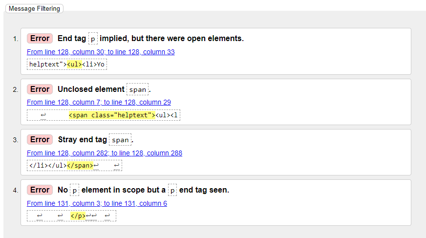
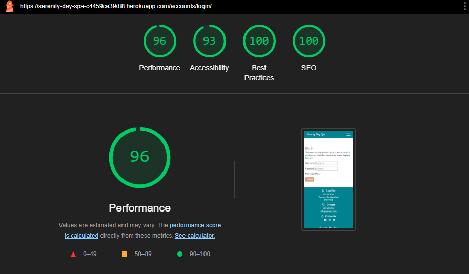

# Testing

This is the TESTING file for [Serenity Day Spa](https://serenity-day-spa-c4459ce39df8.herokuapp.com/)

Return to the [README.md](README.md) file.

## Contents

* [HTML Validation](#html-validation)
* [CSS Validation](#css-validation-using-w3c-validation) 
* [Pep8 Validation](#pep8-validation)
* [Lighthouse scores using Chrome Dev Tools](#lighthouse-scores-using-chrome-dev-tools)
* [Manual Testing](#manual-testing)
* [Bugs](#bugs)

____

#### HTML Validation

For testing my HTML for this project, I used the Validate by Direct Input option on W3C Markup Validation. 

 

I checked all pages of the site in this way and the results are below:

| HTML Page | Errors | Warnings |
| ---- | ------ | -------- | 
| Home | None | None |
| Treatments | None | None |
| Contact | None | None |
| Sign in | None | None |
| Book Now | None | None |
| My Account | None | None |
| Logout | None | None |
| Edit Booking | None | None |
| Delete Booking | None | None |
| Logout | None | None |
| Error 404 | None | None |
| Error 500 | None | None |
| Register | 4 | None |

The Register Page returned 4 errors as show below:

 

As this was a standard AllAuth template, I was unable to make adjustments. For future development of this project I will create a custom Register form.

____

#### CSS Validation

My CSS Validation check returned no errors.

 
____

#### Pep8 Validation

[CI Python Linter](https://pep8ci.herokuapp.com/#) was used to validate the Python files. Some minor line lenght isuues, missing lines, and trailing white space errors were raised and fixed before final deployment.

 

 

| App | admin.py | forms.py | models.py | urls.py | views.py |
|---------|----------|----------|-----------|---------|----------|
|  Main Project | N/A | N/A | N/A | no errors | N/A |
| booking | no errors | no errors | no errors | no errors | no errors |
| home | N/A | N/A | N/A | no errors | no errors |
| treatments | no errors | N/A | no errors | no errors | no errors |
| contact | no errors | no errors | no errors | no errors | no errors|
| user_account | N/A | N/A | N/A | no errors | no errors |

____

#### Lighthouse scores using Chrome Dev Tools

My Lighthouse performace Score for the Home Page is lower than I would have liked for both Mobile and Desktop. This is due to the fact that my carousel images in the Hero section are quite large files. I also suspect that they are loading slower due to being hosted on Cloudinary. I had previously compressed the images and placed them as static files, however this lead to lots of noise and blur within the images. For future development I will look furhter into compressing images without losing so much of the quality.

**DESKTOP**

Home Page

 

  

Treatments List

 

  

Treatment Details

 

  

Contact

 

  

Sign In

 

  

Register

 

  

My Account

 

  

Book Now

 

  

  

**MOBILE**

Home Page

 

  

Treatments List

 

  

Treatment Details

 

  

Contact

 

  

Sign In

 

  

Register

 

  

My Account

 

  

Book Now

 

  

 

The Best Practices Score showed details regarding the Treatmeent Images stating the connection was not secure. This is something I will look into regarding securely loading externally hosted files.
  

____

#### Manual Testing

____

#### Bugs

____