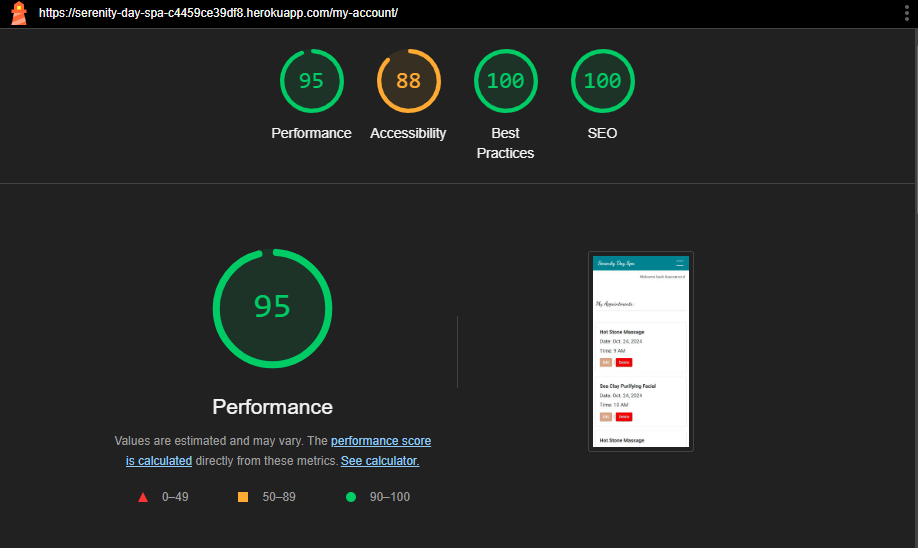

# Testing

This is the TESTING file for [Serenity Day Spa](https://serenity-day-spa-c4459ce39df8.herokuapp.com/)

Return to the [README.md](README.md) file.

## Contents

* [HTML Validation](#html-validation)
* [CSS Validation](#css-validation-using-w3c-validation) 
* [Pep8 Validation](#pep8-validation)
* [Lighthouse scores using Chrome Dev Tools](#lighthouse-scores-using-chrome-dev-tools)
* [Manual Testing](#manual-testing)
* [Bugs](#bugs)

____

#### HTML Validation

For testing my HTML for this project, I used the Validate by Direct Input option on W3C Markup Validation. 

 

I checked all pages of the site in this way and the results are below:

| HTML Page | Errors | Warnings |
| ---- | ------ | -------- | 
| Home | None | None |
| Treatments | None | None |
| Contact | None | None |
| Sign in | None | None |
| Book Now | None | None |
| My Account | None | None |
| Logout | None | None |
| Edit Booking | None | None |
| Delete Booking | None | None |
| Logout | None | None |
| Error 404 | None | None |
| Error 500 | None | None |
| Register | 4 | None |

The Register Page returned 4 errors as show below:

 

As this was a standard AllAuth template, I was unable to make adjustments. For future development of this project I will create a custom Register form.

____

#### CSS Validation

My CSS Validation check returned no errors.

 
____

#### Pep8 Validation

[CI Python Linter](https://pep8ci.herokuapp.com/#) was used to validate the Python files. Some minor line lenght isuues, missing lines, and trailing white space errors were raised and fixed in all .py files before final deployment.

 

 

| App | admin.py | forms.py | models.py | urls.py | views.py |
|---------|----------|----------|-----------|---------|----------|
|  Main Project | N/A | N/A | N/A | no errors | N/A |
| booking | no errors | no errors | no errors | no errors | no errors |
| home | N/A | N/A | N/A | no errors | no errors |
| treatments | no errors | N/A | no errors | no errors | no errors |
| contact | no errors | no errors | no errors | no errors | no errors|
| user_account | N/A | N/A | N/A | no errors | no errors |

____

#### Lighthouse scores using Chrome Dev Tools

My Lighthouse performace Score for the Home Page is lower than I would have liked for both Mobile and Desktop. This is due to the fact that my carousel images in the Hero section are quite large files. I also suspect that they are loading slower due to being larger and hosted on Cloudinary. I had previously compressed the images using TinyPNG and placed them in as static files, however this lead to lots of noise and blur within the images.

**DESKTOP**

Home Page

 

  

Treatments List

 

  

Treatment Details

 

  

Contact

 

  

Sign In

 

  

Register

 

  

My Account

 

  

Book Now

 

  

  

**MOBILE**

Home Page

 

  

Treatments List

 

  

Treatment Details

 

  

Contact

 

  

Sign In

 

  

Register

 

  

My Account

 

  

Book Now

 

  

 

The Best Practices Score showed details regarding the Treatment Images stating the connection was not secure. This is something I will look into regarding securely loading externally hosted files.
  

____

#### Manual Testing

**Navbar**

| Page/Section | User Action    | Expected Result    | PASS/FAIL |
|---------------|---------------|------------------|------------------|
| Navbar - Unregistered Users  |  |  |  |
|  | Click on Logo | Redirect to Home Page | PASS |
|  | Click on ‘Treatments’  | Redirect to Treatments List page | PASS |
|  | Click on ‘Contact’ | Redirect to Contact page | PASS |
|  | Click on ‘Sign In’ | Redirect to Sign In page | PASS |
|  | Click on ‘Register’ button | Redirect to Register page | PASS |
| Navbar - Registerd users  |  |  |  |
|  | Click on ‘Book Now’ | Redirect to Booking page | PASS |
|  | Click on ‘My Account' | Redirect to Users Account page | PASS |
|  | Click on ‘Logout’ | Redirect to logout confirmation page | PASS |
 

**Home Page**

| Page/Section | User Action    | Expected Result    | PASS/FAIL |
|---------------|---------------|------------------|------------------|
| Home  |  |  |  |
|  | Click on ‘View’ button in Popular Treatments tiles | Redirect to appropriate Treatment Details page | PASS |
|  | Click on ‘View All Treatments’ button | Redirect to All Treatments page | PASS |
 

**Footer**

| Page/Section | User Action    | Expected Result    | PASS/FAIL |
|---------------|---------------|------------------|------------------|
| Footer |  |  |  |
|  | Click on social links in footer | Open new tab with appropriate link | PASS |
 

**Treatments List & Treatment Details Pages**

| Page/Section | User Action    | Expected Result    | PASS/FAIL |
|---------------|---------------|------------------|------------------|
| Treatments List |  |  |  |
|  | Click on 'View' button in each Treatment tile | Redirect to appropriate Treatment Details page | PASS |
| Treatment Details |  |  |  |
|  | Click 'Back to all treatments' link | Redirect to All Treatments page  | PASS |
|  | Click 'Login' link | Redirect to Sign In page | PASS |
|  | Click 'Register' link | Redirect to Register page | PASS |
| Registered Users | Click 'Book Now' button | Redirect to Booking page | PASS |
 

**Contact Page**

| Page/Section | User Action    | Expected Result    | PASS/FAIL |
|---------------|---------------|------------------|------------------|
| Contact |  |  |  |
|  | Enter name | Name required | PASS |
|  | Enter invalid email | Will only accept email address format | PASS |
|  | Enter valid email | No error | PASS |
|  | Enter message | No error | PASS |
|  | Click 'Submit' button | Form submits, user recieves feedback message | PASS |
 

**Sign In Page**

| Page/Section | User Action    | Expected Result    | PASS/FAIL |
|---------------|---------------|------------------|------------------|
| Sign In |  |  |  |
|  | Click on 'Register' if you don't have an account | Redirect to Register page | PASS |
|  | Enter invalid username | The username and/or password you specified are not correct message | PASS |
|  | Enter invalid password | The username and/or password you specified are not correct message | PASS |
|  | Try Sign In with empty form| Fill in the form fields prompts | PASS |
|  | Enter valid password and username | Logs in, redirects to Home page, sign in success message, welcome back 'username' displayed under navbar | PASS |
 

**Log Out Page**

| Page/Section | User Action    | Expected Result    | PASS/FAIL |
|---------------|---------------|------------------|------------------|
| Log Out |  |  |  |
|  | Clicks 'Logout' | Redirects to confirm logout page | PASS |
|  | Clicks 'Sign out' button | Redirect to Home page, log out success message | PASS |
 

**Register Page**

| Page/Section | User Action    | Expected Result    | PASS/FAIL |
|---------------|---------------|------------------|------------------|
| Register |  |  |  |
|  | Click on 'Sign In' if you already have an account | Redirect to Sign In page | PASS |
|  | Enter valid username | No error | PASS |
|  | Enter username that already exists | A user with that username already exists message | PASS |
|  | Enter short password | This password is too short. It must contain at least 8 characters. | PASS |
|  | Enter different password in Password(again) field | You must type the same password each time message | PASS |
|  | Enter email | Optional | PASS |
|  | Enter valid username and password, click 'Register' button| Account created, Redirect to Home page, Signed in success message | PASS |
 

**Booking Page**

| Page/Section | User Action    | Expected Result    | PASS/FAIL |
|---------------|---------------|------------------|------------------|
| Booking form |  |  |  |
|  | Select Treatment dropdown | No errors | PASS |
|  | Select Day (Sunday/Monday) | Only book Tuesday - Saturday error message | PASS |
|  | Select Day (Tuesday-Saturday) | No errors | PASS |
|  | Select Time dropdown | No errors | PASS |
|  | Select Day 22 days or more in advance | Only book up to 21 days in advance message | PASS |
|  | Select Day/Time already booked | This day/time is already booked message | PASS |
|  | Select Day that is fully booked | The day is fully booked error message | PASS |
|  | Enter invalid email | Required valid email @ input  | PASS |
|  | Notes | Optional entry | PASS |
|  | All input valid - Click 'Book Now' button | Booking Succesful, Redirect to My Account page, Appointment saved message, list of My Appointments viewable | PASS |
 

**My Account Page**

| Page/Section | User Action    | Expected Result    | PASS/FAIL |
|---------------|---------------|------------------|------------------|
| My Account |  |  |  |
|  | Click 'Book Now' button when user has no appointments yet | Redirect to Booking Page | PASS |
|  | Click 'Edit' appointment button | Redirect to Edit Appointment form | PASS |
| Edit Appointment Form |  |  |  |
|  | Select Day (Sunday/Monday) | Only book Tuesday - Saturday error message | PASS |
|  | Select Day (Tuesday-Saturday) | No errors | PASS |
|  | Select Time dropdown | No errors | PASS |
|  | Select Day 22 days or more in advance | Only book up to 21 days in advance message | PASS |
|  | Select Day/Time already booked | This day/time is already booked message | PASS |
|  | Select Day that is fully booked | The day is fully booked error message | PASS |
|  | All input valid - Click 'Update Appointment' button | Redirect to My Account page, Appointment Updated successfully message, list of updated Appointments viewable | PASS |
| Delete Appointment |  |  |  |
|  | Click on 'Delete' button | Redirects to confirm detele page | PASS |
|  | Click 'Confirm delete' button | Redirects to My Account page, Appointment deleted success message, appointment removed from list of My Appointments | PASS |
|  | Click 'Cancel' button | Redirects to My Account page| PASS |
 

**Custome Handler Pages**

| Page/Section | User Action    | Expected Result    | PASS/FAIL |
|---------------|---------------|------------------|------------------|
| 404 Error Page |  |  |  |
|  | Type in URL that does not exists | Custom 404 Error page is displayed | PASS |
|  | Click on 'Home Page' button | 	Redirects to Home page | PASS |
| 500 Error Page |  |  |  |
|  | Server error | Custom 500 Error page is displayed | PASS |
|  | Click on 'Home Page' button | 	Redirects to Home page | PASS |

**Admin**

| Page/Section | User Action    | Expected Result    | PASS/FAIL |
|---------------|---------------|------------------|------------------|
| Admin Panel |  |  |  |
|  | CRUD Functionality for Treatmnets, Users, Contact Forms | Working as expected | PASS |
 

**Defensive Redirects**

| Page/Section | User Action    | Expected Result    | PASS/FAIL |
|---------------|---------------|------------------|------------------|
| URL |  |  |  |
|  | Type in booking URL when user is not authorised | Redirect to Sign In page | PASS |
|  | Type in booking/edit URL when user is not authorised | Redirect to Sign In page | PASS |
|  | Type in booking/delete URL when user is not authorised | Redirect to Sign In page | PASS |
 
____

#### Testing User Stories

| User Story | Acceptance Criteria Met   | Tested    | PASS/FAIL |
|---------------|---------------|------------------|------------------|
| All Site Users can View List of Treatments | Yes | Yes | PASS |
| All Site Users can Read More about Treatments | Yes | Yes | PASS |
| All Site Users can Contact the business | Yes | Yes | PASS |
| All Site Users can Users can Register and Account | Yes | Yes | PASS |
| Registered Users can Book an Appointment | Yes | Yes | PASS |
| Registered Users can View their Appointments | Yes | Yes | PASS |
| Registered Users can Update/Delete their Appointments | Yes | Yes | PASS |
| Admin can Create new Treatments | Yes | Yes | PASS |
| Admin can Update/Delete existing Treatments | Yes | Yes | PASS |
| Admin can View bookings | Yes | Yes | PASS |
| Admin can store Contact Forms and mark them Read | Yes | Yes | PASS |
| Registered Users can leave a Review | Feature not included in this version - 'Could Have' item | - | - |
| Admin can approve Reviews | Feature not included in this version - 'Could Have' item | - | - |

____

#### Bugs

All tests have passed and there are currently no known bugs at the time of final deployment. 
____